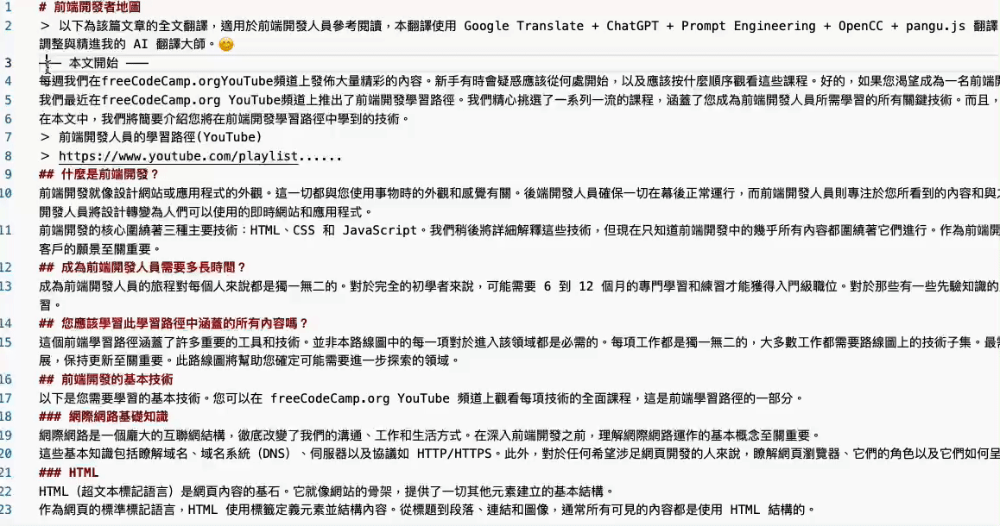
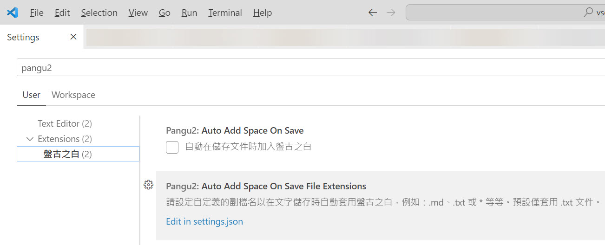

# 盤古之白

如果你跟我一樣，每次看到網頁上的中文字和英文、數字、符號擠在一塊，就會坐立難安，忍不住想在它們之間加個空格。這個 Visual Studio Code 擴充套件會自動替你在文件中所有的中文字和半形的英文、數字、符號之間插入空白。如果有任何建議與討論，歡迎來到[這裡](https://github.com/doggy8088/vscode-pangu2/issues)留言交流。



## 主要特色

* 支援將**選取文字**加入盤古之白
* 支援將**整份文件**加入盤古之白
* 支援 **Markdown** 文件加入盤古之白
* 支援儲存文件時自動加入盤古之白 (預設並未啟用)

## 使用方式

本工具主要有兩個命令：

1. 將編輯器中的**選取範圍**加入盤古之白 (`pangu2.add_space_selection`)
2. 將編輯器中的**整份文件**加入盤古之白 (`pangu2.add_space_whole`)

使用方式也有兩種：

1. 在編輯中按下滑鼠右鍵，選擇 `Pangu: 加入盤古之白 (選取範圍)` 或 `Pangu: 加入盤古之白 (整份文件)` 命令。

    程式會自動判斷你目前是否有選取文字，如果有選取文字，就只會顯示 `Pangu: 加入盤古之白 (選取範圍)` 在右鍵選單中。

    反之，沒有選取文字時，預設只會顯示 `Pangu: 加入盤古之白 (整份文件)` 在右鍵選單中。

2. 在編輯器中按下 `F1` 後輸入 `pangu` 搜尋命令，有 `Pangu: 加入盤古之白 (選取範圍)` 或 `Pangu: 加入盤古之白 (整份文件)` 可以選擇。

## 選項設定



主要設定有兩個，分別是：

1. `pangu2.autoAddSpaceOnSave` (boolean)

    設定是否要自動在儲存文件時加入盤古之白。預設為 `false`。

2. `pangu2.autoAddSpaceOnSaveFileExtensions` (array)

    設定僅在特定檔案類型儲存時自動執行盤古之白。預設為 `[ ".txt" ]`。

    若設定為 `[ "*" ]`，則代表**所有檔案類型**都會自動加入盤古之白。

    > 注意：此設定僅在 `pangu2.autoAddSpaceOnSave` 為 `true` 時才會生效。

設定範例如下：

```js
{
  "pangu2.autoAddSpaceOnSave": true,
  "pangu2.autoAddSpaceOnSaveFileExtensions": [
    ".txt",
    ".md"
  ]
}
```

## 已知問題

* 目前僅支援 HTML、Markdown 與純文字文件可以正常運作，若套用其他類型的文件上，可能會導致部分語法錯誤。

* 若要在任何程式語言中使用本套件，請多利用將**選取文字**加入盤古之白的功能套用在註解上，以避免程式碼被破壞。

## 感謝

本擴充套件源自 [vinta/pangu.js](https://github.com/vinta/pangu.js) 專案的幫助，自動在中文和英文、數字、符號之間插入空白。

部分程式碼參考自 [halfcrazy/vscode-pangu](https://github.com/halfcrazy/vscode-pangu) 的實作，並加以優化改進。
